# TinyLoRA-Qwen-Coder Experiment

<div align="center">

**强化学习训练超参数压缩模型：Qwen2.5-Coder-Instruct on CodeContests**<br>

**Version 2.5**

[中文版本](#中文版本) | [English Version](#english-version)

本项目是在 [Qwen4Luogu-RL](https://github.com/Chi-Shan0707/Qwen4Luogu-RL) 的基础上进行的改进与实验。

如果这个项目对你有帮助，或者你觉得有点意思，请点击右上角的 Star 支持一下！这对我很重要，万分感谢PwP！<br>
If you find this project useful or interesting, please give it a Star! 🌟 Your support is my greatest motivation.<br>
</div>

---

## 更新日志 / Changelog

### v2.5 — 关键 Bug 修复 (Critical Bug Fixes)

本次更新修复了导致**训练零梯度、测试零代码提取**的三个关键缺陷：

| # | Bug 描述 | 影响 | 修复 |
| :---: | :--- | :--- | :--- |
| **1** | `global_v` 初始化为 `randn` 而非 `zeros` | 所有线性层从第一次前向传播起就受到巨大的随机扰动（$\Delta W$ 量级 ~400），导致模型输出乱码，无法提取代码，GRPO 奖励全为 0，梯度为 0，参数永远无法更新 | `utils.py`: `TinyLoRAGlobalParams.__init__` 中改为 `torch.zeros(...)` |
| **2** | 训练与测试的随机种子对齐错误 | 训练时种子在 `apply_tiny_lora` 前**紧邻**设置；测试时种子在**模型加载前**设置，模型加载消耗大量随机状态，导致 P 矩阵不一致，已训练的 `v` 向量与错误的 P 矩阵搭配产生错误的 $\Delta W$ | `test.py`: 在 `apply_tiny_lora` 调用前重新设置种子 |
| **3** | P 矩阵缺少 $1/\sqrt{r}$ 缩放 | 梯度量级控制不佳，论文建议使用缩放因子以稳定方差 | `utils.py`: P 矩阵生成时除以 `rank ** 0.5` |

**症状链（v2.0 及之前）：**
```
global_v ~ N(0,1) → ΔW 量级爆炸 → 模型输出乱码 → 无法提取代码
→ reward 全为 0 → GRPO advantage = 0/0 → grad_norm = 0, loss = 0
→ v 永不更新 → 保存的 checkpoint 仍为随机值 → 测试同样失败
```

> **重要**：v2.5 修改了 P 矩阵缩放和 `global_v` 初始化方式，旧版本的 checkpoint（`.pt` 文件）**不兼容**，需要重新训练。

### v2.0 — 模块化重构 & 验证系统
- 将共享工具提取到 `utils.py`
- 新增 `validate.py` 和 `test.py`
- 支持训练中验证与最佳模型自动保存
- 支持基线测试（`--baseline`）

---

# 中文版本

## TinyLoRA-Qwen-Coder 实验

本仓库是原「LuoguQwen LoRA 微调」，一个[基于 SFT的项目](https://github.com/Chi-Shan0707/Qwen4Luogu-SFT)以及[强化学习项目](https://github.com/Chi-Shan0707/Qwen4Luogu-RL)的进阶进化版：

*以下是SFT时的心路历程*<br>
> 什么，你问我为什么要挑选 Qwen2.5-1.5B-Instruct 进行微调？<br>
> —— 那当然是因为它参数量小啦。<br>
>
> 什么，你继续问我为什么不挑选 Qwen2.5-Coder-1.5B-Instruct 进行微调？<br>
> ~~我如果在这阿里进行过代码训练上的模型进行微调，哪能看得出我微调的效果？~~<br>
> ~~好吧，其实是我问千问有什么参数量小的模型，它推荐了这个，然后我一时间忘记继续去搜集信息，直接开搞惹，结果训练到一半才在 ModelScope 上刷到 Qwen2.5-Coder-1.5B-Instruct。PWP~~<br>
> ~~第一遍实在太差了，反正还要再训练一遍，还是弄 Qwen2.5-Coder-1.5B-Instruct 吧~~<br>
> 这个也太差劲了，上 7B 吧 PwP<br>
> *不对，为什么疯狂报 mismatch 啊啊？从 1.5B→7B 我啥都没改啊？*<br>
> *疯狂 debug，疯狂研究格式……*<br>
> 算了，格式弄成所谓的标准型吧。<br>
> 7B 根本跑不动啊，只能 3B。<br>
> ~~啊训练完了，参数根本上传不动啊？啊，huggingface 也上传不动啊 PwP~~<br>

然后，6号晚上，~~天助我也~~，我看到了TinyLoRA的论文，所以我就开始了这项尝试（或者可以说“复现”），成果见[Qwen4Luogu-RL](https://github.com/Chi-Shan0707/Qwen4Luogu-RL)：
- 基座：Qwen2.5-Coder-3B-Instruct，4bit 量化以挤爆最后一点显存；
- 训练：不用 SFT，用 RL（GRPO）；
- 数据：Luogu上的题目
- 参数：全模型只保留 **16 个可训练标量参数**；
- 任务：用「编译+运行 C++ 代码」的方式在 CodeContests 题目上搞代码强化学习。
<br>

在[Qwen4Luogu-RL](https://github.com/Chi-Shan0707/Qwen4Luogu-RL)中，这个`train_rl.py`是可以运行且训练的，但是能成功运行+通过样例测试的，十不存一（并没有夸张）。<br>
原因可能有:
- 提示词写的不好，下一步需要明确【是否要推理路径】等细节，并开展Prompt Engineering
- token数量截取的太少，目前是1024，但是这个也会带来成本
- GRPO时生成答案数量太少
- 训练所用的luogu题目太难
- RL的reward写的不够好
- 3B模型本身能力不行<br>

<br>

所以在这里，我采用了另一个数据集 [deepmind/code_contests](https://huggingface.co/datasets/deepmind/code_contests) ，其具有以下优势：

> - **题目规模更大**：拥有海量的竞赛级题目。
> - **英语环境**：适配主流代码模型的训练偏好。
> - **难度调控**：支持题目难度的精细化筛选。
> - **测试用例极其丰富**：显著提升模型逻辑验证的准确性。

---

## 目录

- [项目概述](#项目概述)
- [项目结构](#项目结构)
- [论文复现](#论文复现)
- [核心特点](#核心特点)
- [快速开始](#快速开始)
- [数据准备与格式](#数据准备与格式)
- [训练流程（RL / GRPO）](#训练流程rl--grpo)
- [验证与测试](#验证与测试)
- [TinyLoRA Tiling 技术细节](#tinylora-tiling-技术细节)
- [奖励函数：编译运行 C++ 代码](#奖励函数编译运行-c-代码)
- [资源消耗与注意事项](#资源消耗与注意事项)
- [开源与许可证](#开源与许可证)
- [引用](#引用)


---

## 项目概述

LuoguQwen-RL 的目标是：

> 在显存受限（3B 模型 + 4bit 量化）且参数极致压缩（仅 16 个参数）的前提下，
> 通过强化学习让 Qwen2.5-Coder 在 CodeContests 竞赛题上学会「能过样例」的 C++ 代码生成。

本仓库并不是凭空设计的，而是一个**TinyLoRA 论文方向的复现与变体实验**：

- `theory/README.md` 中给出了 TinyLoRA / GRPO 的理论与工程细节梳理；
- 本项目在此基础上，将 TinyLoRA 的思想从数学推理（如 GSM8K）迁移到**代码生成 + 编译执行奖励**场景；
- 论文中经典设置是 7B 模型 + 13 个参数，本仓库使用 3B Coder 模型 + 16 个参数，保持「极低秩 + 全局共享」这一精神内核。

核心脚本：

- `train_rl.py`：
  - 加载 4bit 量化的 `Qwen2.5-Coder-3B-Instruct`；
  - 将指定 Linear 层替换为自定义 `TinyLoRALinear`，并通过共享向量 `global_v` 实现 TinyLoRA Tiling；
  - 使用 TRL 的 `GRPOTrainer` 进行代码强化学习；
  - 奖励来自本地 `g++` 编译 + 测试用例执行通过率。
- `download_dataset.py`：
  - 从 DeepMind 的 `code_contests` 数据集（AlphaCode）中流式下载、过滤并保存为本地 JSONL 格式。
- `verify_pipeline.py`：
  - 用于验证模型加载、生成、代码提取与编译运行的端到端流水线（示例：加载模型并尝试用给定样例对生成代码进行编译运行评测）。

目录结构（节选）：

- `train_rl.py`：主训练脚本（TinyLoRA + GRPO）。
- `download_dataset.py`：流式下载并预处理 CodeContests 数据。
- `verify_pipeline.py`：验证 model->generate->extract->compile 流程的脚本。
- `local_code_contests/`：本地存储的 CodeContests 训练/验证/测试数据（JSONL 格式）。
- `models/Qwen2.5-Coder-3B-Instruct/`：基座模型目录（可通过 ModelScope 自动下载）。
- `output/`：RL 训练输出目录（包括最终的 `tiny_lora_v.pt`，内含 `global_v` 向量及重建所需的元信息）。

---
## 项目结构

本项目采用模块化设计，将训练、验证和测试逻辑分离，提高代码可维护性和可重复性。

### 核心模块

#### 1. `utils.py` - 共享工具模块

包含所有训练、验证和测试共享的核心功能：

- **TinyLoRA 类**：
  - `TinyLoRAGlobalParams`: 全局共享向量容器
  - `TinyLoRALinear`: 自定义 TinyLoRA 线性层
  - `apply_tiny_lora()`: 将 TinyLoRA 层注入模型

- **代码评估功能**：
  - `compile_and_run()`: C++ 代码编译和运行
  - `extract_code_from_response()`: 从模型响应中提取代码
  - `convert_hf_tests_to_list()`: 转换测试用例格式

- **模型加载工具**：
  - `get_model_and_tokenizer()`: 加载 4-bit 量化模型和分词器

#### 2. `train_rl.py` - 训练脚本

主训练脚本，支持可选的验证功能：

```bash
# 基本训练 / Basic training
python train_rl.py [u_value] [max_samples]

# 带验证的训练 / Training with validation
python train_rl.py 16 2000 --do_validate --val_steps 100 --val_samples 10
```

**命令行参数 / Command-line Arguments:**
- `u_value`: TinyLoRA 共享向量维度（默认 16）
- `max_samples`: 最大训练样本数（默认 2000）
- `--do_validate`: 启用训练期间验证
- `--val_steps N`: 每 N 步进行一次验证（默认 100）
- `--val_samples N`: 验证样本数（默认 10）

**验证功能**：
- 训练期间自动运行验证
- 跟踪最佳 Pass@1 分数
- 自动保存最佳模型至 `best_tiny_lora_v.pt`

#### 3. `validate.py` - 验证脚本

可以作为独立脚本运行，也可以被 `train_rl.py` 导入：

```bash
# 独立验证 / Standalone validation
python validate.py [num_samples]
```

**功能**：
- 加载训练好的检查点
- 在验证集上评估模型
- 计算 Pass@1、编译成功率等指标

#### 4. `test.py` - 测试脚本

用于在测试集上评估最终模型：

```bash
# 基本测试 - 测试 TinyLoRA 微调模型（使用命名参数）
python test.py --checkpoint_path <path> --num_samples <N>

# 基线测试 - 测试原始基座模型（不含 TinyLoRA，使用命名参数）
python test.py --baseline --num_samples <N>

# 示例 / Examples
python test.py --checkpoint_path ./output/luoguqwencoder-lora/tiny_lora_v.pt --num_samples 50      # 测试微调模型
python test.py --checkpoint_path ./output/luoguqwencoder-lora/best_tiny_lora_v.pt --num_samples 100 # 测试最佳模型
python test.py --baseline --num_samples 50                                                      # 测试基座模型（对比）
python test.py --checkpoint_path ./output/luoguqwencoder-lora/tiny_lora_v.pt --num_samples 50 --test_data ./local_code_contests/code_contests_test.jsonl
```

**功能**：
- **TinyLoRA 模式**（默认）：从 `.pt` 检查点加载元数据（seed, u_value, rank）
  - 设置随机种子以确保 P 矩阵一致
  - 加载基座模型并注入 TinyLoRA
  - 加载训练权重 `global_v`
- **基线模式**（`--baseline`）：直接运行原始基座模型，用于对比微调效果
  - 不加载检查点
  - 不注入 TinyLoRA
  - 可视化微调的性能提升
- 在测试集上运行评估

#### 5. `download_dataset.py` - 数据集下载脚本

从 HuggingFace 流式下载 CodeContests 数据集：

```bash
python download_dataset.py
```

### 工作流程

```mermaid
graph LR
    A[下载数据集] --> B[训练模型]
    B --> C[验证（可选）]
    C --> D[保存最佳模型]
    D --> E[测试评估]
    
    style A fill:#e1f5ff
    style B fill:#fff3e0
    style C fill:#f3e5f5
    style D fill:#e8f5e9
    style E fill:#fce4ec
```



1. **数据准备**: 运行 `download_dataset.py` 下载并预处理数据
2. **模型训练**: 运行 `train_rl.py` 进行 RL 训练（可选带验证）
3. **训练中验证**: 如果启用 `--do_validate`，会在训练过程中定期验证
4. **保存最佳模型**: 验证分数提高时自动保存 `best_tiny_lora_v.pt`
5. **最终测试**: 运行 `test.py` 在测试集上评估模型

### 文件依赖关系

```
utils.py (基础工具)
  │
  ├── train_rl.py (导入并使用)
  │   └── 调用 validate.py
  │
  ├── validate.py (导入并使用)
  │
  └── test.py (导入并使用)
```

所有脚本都依赖 `utils.py` 中的共享功能，确保代码一致性和可维护性。

---
## 论文复现

[cite_start]本项目是论文 **"Learning to Reason in 13 Parameters" (Morris et al., 2026)** 的非官方复现与工程适配 [cite: 2]。

### 1. 核心理论：TinyLoRA
原论文提出了一种极端的参数高效微调方法 **TinyLoRA**，旨在打破 LoRA 的秩（Rank）限制。
- [cite_start]**痛点**：传统 LoRA 即使 Rank=1，其参数量仍与模型宽度 $d$ 成正比（$O(d \times r)$），对于 7B 模型约为数百万参数 [cite: 17, 158]。
- [cite_start]**创新**：TinyLoRA 利用 SVD 冻结原权重的特征方向 ($U, V$)，仅学习一个极小的向量 $v$。通过在不同层之间共享这个向量（**Tiling**），可将全网可训练参数压缩至个位数 [cite: 7, 175, 181]。
- **公式**：
  $$W' = W + U \Sigma (\sum_{i=1}^{u} v_i P_i) V^\top$$
  [cite_start]其中 $U, \Sigma, V$ 来自原权重的 SVD 分解（冻结），$P$ 是固定随机投影，$v$ 是唯一的可训练参数 [cite: 173, 174]。

### 2. 为什么必须是 RL？
[cite_start]论文的核心发现是：**在如此极端的参数限制下（<100 参数），SFT（监督微调）几乎完全失效，只有 RL（强化学习）能奏效** [cite: 10, 65]。
- [cite_start]**SFT 的局限**：SFT 强迫模型记忆参考答案的格式和风格（"Noise"），这需要较大的容量 [cite: 147, 148]。
- [cite_start]**RL 的优势**：RL 仅关注最终结果的对错（"Signal"），允许模型忽略无关细节。TinyLoRA 正是利用这一点，在仅有 13 个参数的情况下，通过 GRPO 算法在 GSM8K 上达到了 91% 的准确率 [cite: 64, 149]。

### 3. 本项目的“魔改”适配
我们遵循论文的精神内核，但针对**代码生成任务**和**消费级显卡**进行了适配：

| 特性 | 原论文设置 (Paper) | 本项目适配 (Ours) |
| :--- | :--- | :--- |
| **任务领域** | [cite_start]数学推理 (GSM8K, MATH) [cite: 8] | **代码竞赛 (CodeContests / AlphaCode)** |
| **基座模型** | [cite_start]Qwen2.5-7B / Llama-3 [cite: 64] | **Qwen2.5-Coder-3B-Instruct** |
| **参数量** | 13 参数 ($u=13$) | **16 参数 ($u=16$)** （可调）|
| **精度处理** | [cite_start]BF16 / FP32 [cite: 8] | **4-bit 量化 (NF4) + 动态反量化 SVD** |
| **奖励机制** | 答案匹配 (Exact Match) | **g++ 编译 + 测试用例运行 (RLVR)** |
| **显存优化** | 需高显存 (A100/H100) | **适配单卡消费级 GPU (16GB+)** |

> **关键工程挑战**：原论文未涉及 4-bit 量化模型。本项目额外实现了在初始化阶段对 4-bit 权重进行 `dequantize` 解包，在 CPU 上完成 FP32 精度的 SVD 分解，再转回 BF16 注册为 Buffer 的流程，从而在低显存环境下实现了 TinyLoRA 初始化。

## 核心特点

- **极致参数压缩**：
  - 整个模型的可训练参数只有一个向量 `global_v ∈ R^{16}`；
  - 全网所有被替换的 Linear 层都共享这 16 个标量；
  - 你可以通过运行 `train_rl.py` 或 `verify_pipeline.py` 来查看模型参数信息（总参数量 / 可训练参数量 / 压缩率）。

- **TinyLoRA Tiling**：
  - 对原始 Linear 权重（包括 4bit 量化权重）做 SVD 分解，得到固定的骨架 `U, S, Vh`；
  - 再通过随机矩阵簇 `P ∈ R^{u×r×r}` 与共享向量 `v ∈ R^u` 重构一个低秩增量；
  - 只训练 `v`，实现论文中的 Tiling / 全参数共享。

- **真实代码环境奖励**：
  - 把模型生成的 C++ 代码写入临时文件；
  - 使用系统 `g++` 编译；
  - 三档离散 reward：编译失败=0，编译成功但样例错误=0.5，通过样例=1.0；
  - 代码不通过编译 / 超时 / 运行错误 -> reward 直接趋近于 0。

- **显存友好**：
  - 基座为 3B Coder 模型，结合 bitsandbytes 4bit 量化 + BF16 计算；
  - 在单卡有限显存环境下也能跑完整的 RL loop（当然，会比较慢）。

---

## 快速开始

### 1. 环境准备

建议使用 Linux + Python 3.10 及以上版本，并确保已安装 `g++` 编译器。

```bash
python -m venv .venv
source .venv/bin/activate

pip install -r requirements.txt
```

> 提示：`requirements.txt` 中已包含 `torch`、`transformers`、`datasets`、`trl`、`peft`、`bitsandbytes`、`modelscope` 等依赖。

### 2. 下载基座模型

`train_rl.py` 会在本地不存在模型时，自动通过 ModelScope 下载：

- 模型 ID：`qwen/Qwen2.5-Coder-3B-Instruct`
- 默认本地路径：`./models/Qwen2.5-Coder-3B-Instruct`

你也可以显式调用：

```python
from modelscope.hub.snapshot_download import snapshot_download

snapshot_download(
    repo_id="qwen/Qwen2.5-Coder-3B-Instruct",
    local_dir="./models/Qwen2.5-Coder-3B-Instruct",
)
```

### 3. 准备 CodeContests 数据

运行以下脚本从 Hugging Face 流式下载并预处理数据：

```bash
python download_dataset.py
```

`download_dataset.py` 会：
- 从 DeepMind 的 `code_contests` 数据集中流式读取数据；
- 仅保留 `description`, `public_tests` 等核心字段以节省空间；
- 将数据保存到 `./local_code_contests/` 目录下的 JSONL 文件中。

### 4. 验证流水线

在真正训练前，可执行以下脚本检查环境是否准备就绪：

```bash
python verify_pipeline.py
```

`verify_pipeline.py` 会加载模型，并尝试对预设的测试用例进行生成、提取与编译运行。

### 5. 启动 RL 训练

基础用法（使用默认u=16，训练全部数据）：

```bash
python train_rl.py
```

自定义 TinyLoRA 参数数量（u 值）：

```bash
python train_rl.py 32     # 使用 u=32（32 个可训练参数）
python train_rl.py 8      # 使用 u=8（8 个可训练参数）
```

限制训练样本数量：

```bash
python train_rl.py 16 100      # u=16，仅训练前 100 个样本
python train_rl.py 32 50       # u=32，仅训练前 50 个样本
python train_rl.py 16          # u=16，训练全部样本（第二个参数可省略）
```

> **参数说明**：
> - **第一个参数** `u`：TinyLoRA 中共享向量 `global_v` 的维度，即可训练参数的总数。若不提供，则默认使用 `u=16`。
> - **第二个参数** `MAX_SAMPLES`：最多训练的样本数量。若不提供，则使用全部数据集。这个参数在快速实验、调试超参数或显存不足时非常有用。 目前是shuffle后取数据集（原数据集每道题目会出现2次），故如此。（目前种子是全局的TINYLORA_SEED。）

`train_rl.py` 将会：

1. 确保基座模型已准备好（必要时自动下载）；
2. 以 4bit 量化方式加载 `Qwen2.5-Coder-3B-Instruct`；
3. 根据命令行参数创建 u 维的共享向量；
4. 注入 TinyLoRA Tiling（全局共享 `global_v`）；
5. 从 `./local_code_contests/code_contests_train.jsonl` 读取 RL 数据；
6. 若指定了 `MAX_SAMPLES`，则仅选取前 N 个样本进行训练；
7. 使用 `GRPOTrainer` 进行强化学习；
8. 训练完成后，将训练结果保存为 `output/tiny_lora_v.pt`。

**保存内容**：`tiny_lora_v.pt` 是一个 dict，包含还原模型所需的全部信息：

```python
{
    "global_v": tensor([...]),     # 训练好的 v 向量，shape=(u,)
    "u_value": 32,                 # v 的维度
    "rank": 2,                     # TinyLoRA 的 rank
    "seed": 42,                    # P 矩阵的随机种子（用于复现）
    "model_id": "qwen/Qwen2.5-Coder-3B-Instruct",  # 基座模型 ID
    "total_replaced_layers": 252,  # 替换的层数
}
```

> **还原方式**：加载基座模型 → 用相同 `seed` 固定随机种子 → 用相同 `u_value` 和 `rank` 执行 `apply_tiny_lora` → 将 `global_v` 加载回 `global_params.global_v`。种子相同保证 P 矩阵完全一致，SVD 是确定性运算所以 U/S/Vh 也一致。
>
> **❗ v2.5 关键提示**：种子必须在 `apply_tiny_lora` 调用**紧前**设置，**不能**在模型加载之前设置（模型加载会消耗随机状态，导致 P 矩阵不一致）。

如果你想自定义输出目录，可以修改 `train_rl.py` 顶部的：

```python
OUTPUT_DIR = "./output/luoguqwencoder-lora"
```

---

## 数据准备与格式

### 上游数据：CodeContests (AlphaCode)

- **数据来源**：DeepMind `code_contests` (https://github.com/google-deepmind/code_contests)。

每一行是一个 JSON 对齐的题目对象，包含：
- `description`: 题目描述。
- `public_tests`: 公开测试样例。
- `private_tests`: 隐藏测试样例。

### RL 训练数据：JSONL 格式

`download_dataset.py` 生成的 JSONL 格式如下：

```json
{
  "description": "<题目描述>",
  "public_tests": {
    "input": ["<input1>", "<input2>"],
    "output": ["<output1>", "<output2>"]
  }
}
```

在 `train_rl.py` 中通过 `map(apply_chat_template)` 将其转换为模型所需的 prompt 格式。

### 数据过滤与奖励配置 (Dataset & Reward Config)

为了提高训练效率并针对性地优化特定难度的题目，我们在 `train_rl.py` 中引入了基于 **Source (来源)** 和 **Difficulty (难度)** 的双层过滤与奖励机制：

1. **题目过滤 (`DATASET_CONFIG`)**：
   - 允许根据不同的判题平台（如 Codeforces、AtCoder）选择特定的难度区间。
   - 默认配置：仅保留 Codeforces 和 AtCoder 的 A-B 级别入门题目（Difficulty 7, 8）。

2. **奖励缩放 (`REWARD_SCALING_CONFIG`)**：
   - **第一关键字 (Source)**：根据平台调整基础权重。
   - **第二关键字 (Difficulty)**：在同一平台内，针对更难的题目给予更高的奖励倍数（Multiplier）。
   - 示例：通过 B 级题目的奖励比通过 A 级题目高出 10% ($1.1 \times$ vs $1.0 \times$)。

这种机制可以帮助模型在保持「能过样例」的基础上，优先学习具有挑战性的逻辑。

---

## 训练流程（RL / GRPO）

核心训练逻辑位于 `train_rl.py`：

1. **模型加载与量化**
   - 使用 `BitsAndBytesConfig`：
     - `load_in_4bit=True`
     - `bnb_4bit_quant_type="nf4"`
     - `bnb_4bit_use_double_quant=True`
     - `bnb_4bit_compute_dtype=torch.float16`
   - 通过 `device_map="auto"` 将模型自动切分到可用 GPU。

2. **TinyLoRA 注入与参数冻结**
   - 创建全局共享向量（维度由命令行参数 `u` 决定，默认16）：
     - `global_v = nn.Parameter(torch.zeros(U_VALUE))`
   - **注意 (v2.5)**：必须初始化为 `zeros`，不能使用 `randn`！`randn` 初始化会导致 $\Delta W$ 爆炸、模型乱码、梯度为零的连锁故障。
   - 通过 `apply_tiny_lora(model, global_v)`：
     - 遍历模型子模块；
     - 找到名字以 `q_proj / k_proj / v_proj / o_proj / gate_proj / up_proj / down_proj` 结尾的 `nn.Linear`；
     - 替换为 `TinyLoRALinear`；
   - 随后：
     - 仅保留 `global_v` 的 `requires_grad=True`；
     - 其他所有参数全部 `requires_grad=False`。

3. **GRPO 配置**

`train_rl.py` 中使用的示例超参数：

- `num_train_epochs=1`
- `per_device_train_batch_size=1`
- `gradient_accumulation_steps=8`
- `learning_rate=1e-5`
- `num_generations=4`（Group Size G，每个样本采样 4 个答案）
- `max_completion_length=512`
- `bf16=True`

你可以根据显存与训练时间需求调整上面的参数。

4. **训练循环**

GRPO 的整体流程简要为：

- 对于每个样本 `prompt`：
  1. 采样多个 `completions`（C++ 代码）；
  2. 调用 `code_reward_func` 对每个 completion 编译 + 运行，得到 reward；
  3. 使用 GRPO 算法根据 reward 更新策略（这里就是更新 16 维的 `global_v`）。


支持自定义的GRPO，如reward设置。

---

## 验证与测试

### 训练中验证（Validation during Training）

从 v2.0 开始，`train_rl.py` 支持在训练过程中定期运行验证：

```bash
# 启用验证 / Enable validation
python train_rl.py 16 2000 --do_validate --val_steps 100 --val_samples 10
```

**参数说明**：
- `--do_validate`: 启用验证功能
- `--val_steps N`: 每 N 个训练步骤运行一次验证（默认 100）
- `--val_samples N`: 每次验证使用的样本数（默认 10）

**验证流程**：
1. 在指定步骤触发验证回调
2. 在验证集上生成代码并编译运行
3. 计算 Pass@1、编译成功率等指标
4. 如果 Pass@1 提高，自动保存到 `best_tiny_lora_v.pt`

**输出示例**：
```
================================================================================
🔍 Running validation at step 100 / 在第 100 步运行验证
================================================================================

📊 Validation Results / 验证结果:
  • Average Score / 平均分数: 0.6500
  • Compile Rate / 编译成功率: 80.00%
  • Pass@1 / 通过率: 35.00%
  • Compile Success / 编译成功: 8/10
  • Full Pass / 完全通过: 3/10

================================================================================
🎉 New best model! / 新的最佳模型！
   Previous best Pass@1 / 之前最佳通过率: 0.00%
   Current Pass@1 / 当前通过率: 35.00%
================================================================================

💾 Best model saved to / 最佳模型已保存至: ./output/luoguqwencoder-lora/best_tiny_lora_v.pt
```

### 独立验证（Standalone Validation）

也可以在训练后单独运行验证：

```bash
# 使用默认设置 / Use default settings
python validate.py

# 自定义验证样本数 / Custom number of samples
python validate.py 50
```

`validate.py` 会：
1. 加载 `./output/luoguqwencoder-lora/tiny_lora_v.pt` 检查点
2. 重建 TinyLoRA 模型
3. 在验证集上评估
4. 输出详细指标

### 测试评估（Testing）

在训练完成后，使用 `test.py` 在测试集上进行最终评估：

```bash
# 基本用法 / Basic usage (named args)
python test.py --checkpoint_path ./output/luoguqwencoder-lora/tiny_lora_v.pt --num_samples 50

# 测试最佳模型 / Test best model
python test.py --checkpoint_path ./output/luoguqwencoder-lora/best_tiny_lora_v.pt --num_samples 100

# 自定义测试数据 / Custom test data
python test.py --checkpoint_path ./output/luoguqwencoder-lora/tiny_lora_v.pt --num_samples 50 --test_data ./local_code_contests/code_contests_test.jsonl
```

**命令行参数**：
- `--checkpoint_path`: 检查点路径（默认 `./output/luoguqwencoder-lora/tiny_lora_v.pt`）
- `--num_samples`: 测试样本数（默认 50）
- `--test_data`: 测试数据集路径

**测试流程**：
1. **加载检查点**：读取 `.pt` 文件中的元数据（`seed`, `u_value`, `rank`）
2. **设置随机种子**：使用 `torch.manual_seed(seed)` 确保 P 矩阵一致
3. **加载基座模型**：使用 4-bit 量化加载 `Qwen2.5-Coder-3B-Instruct`
4. **注入 TinyLoRA**：使用相同的 `u_value` 和 `seed` 执行 `apply_tiny_lora`
5. **加载权重**：将 `global_v` 加载到模型
6. **运行评估**：在测试集上生成代码并评估

**输出示例**：
```
================================================================================
✅ Evaluation complete / 评估完成
================================================================================

📊 Test Results / 测试结果:
   • Total Samples / 总样本数: 50
   • Average Score / 平均分数: 0.7200
   • Compile Rate / 编译成功率: 86.00% (43/50)
   • Pass@1 / 完全通过率: 42.00% (21/50)
   • Partial Pass / 部分通过: 22/50
   • No Code Extracted / 未提取到代码: 7/50
================================================================================
```

### 检查点文件格式

训练和验证保存的 `.pt` 文件包含以下信息：

```python
{
    "global_v": tensor([...]),           # 训练好的共享向量
    "u_value": 16,                       # 向量维度
    "rank": 2,                           # TinyLoRA 秩
    "seed": 42,                          # 随机种子（用于重建 P 矩阵）
    "model_id": "qwen/Qwen2.5-Coder-3B-Instruct",  # 基座模型 ID
    "total_replaced_layers": 252,       # 替换的层数
    "validation_score": 0.42,           # 验证分数（仅 best_tiny_lora_v.pt）
    "step": 500,                         # 训练步数（仅 best_tiny_lora_v.pt）
}
```

**重要提示**：
- 随机种子 `seed` 对于重现至关重要，P 矩阵由它生成
- SVD 分解是确定性运算，U/S/Vh 可完全复现
- 只要 `seed`, `u_value`, `rank` 相同，就能完全重建模型

---

## TinyLoRA Tiling 技术细节

自定义层 `TinyLoRALinear` 的核心思想：

1. 对原始权重矩阵 `W ∈ R^{out×in}` 做 SVD：

   $$W = U S V^H$$

   - 实现中先将 4bit 权重反量化为 `W_real`，再在 CPU 上做 `torch.linalg.svd`；
   - 只取前 `rank=2` 个奇异值及对应的列 / 行，得到精简版 `U, S, V^H`；
   - 这些张量通过 `register_buffer` 注册为 Buffer，不参与训练。

2. 定义全局共享参数：

   - `v ∈ R^u`，其中 `u=16`；
   - 随机初始化一组固定矩阵簇 `P ∈ R^{u×r×r}`；
   - 构造：

     $$R = \sum_{i=1}^{u} v_i P_i \in R^{r×r}$$

3. 构造增量权重：

   - $$\Delta W = U S R V^H$$
   - 实际前向中计算：

     $$y = x W^T + x (\Delta W)^T$$

4. Tiling（跨层共享）

   - 模型中所有目标 `nn.Linear` 层都共享同一个 `v`；
   - 整个模型只有这一组 16 维参数在更新。

你可以通过 `verify_pipeline.py` 或直接观察 `train_rl.py` 的启动日志来确认 TinyLoRA 注入是否正确并检查可训练参数量。

---

## 奖励函数：编译运行 C++ 代码

奖励函数实现位于 `train_rl.py` 中的 `code_reward_func` 与 `compile_and_run`：

1. **从模型输出中提取代码**
   - 优先匹配形如：

     ```markdown
          ```cpp
          // C++ 代码
          ```
     ```

   - 若没有显式代码块，则回退为只要包含 `#include` 的裸代码段；
   - 若仍无法识别，则直接给 0 分。

2. **编译阶段**
   - 将代码写入临时目录中的 `solution.cpp`；
   - 通过正则删除代码中的 `freopen(...)` 等文件重定向语句，改用标准输入输出；
   - 使用：

     ```bash
     g++ solution.cpp -o solution -O2
     ```

   - 编译失败 / 超时 -> 本次样本 reward = 0。

3. **运行阶段**
   - 对每个测试用例：
     - 将 `case["input"]` 作为 stdin；
     - 捕获 stdout，与 `case["output"]` 进行字符串级比对（`strip()` 后）；
   - 运行有超时保护（例如 2 秒），防止死循环卡死训练。

4. **打分规则**

   奖励函数采用三档评分制：

   - **编译失败** 或 **代码格式无效**：`reward = 0`
     - 包括编译错误、编译超时、无法提取代码块等情况；
   
   - **编译成功但测试用例失败**：`reward = 0.5`
     - 代码能通过 g++ 编译，但运行后不能通过全部样例测试（可能通过部分或全部失败）；
   
   - **编译成功且通过所有测试用例**：`reward = 1.0`
     - 代码既能编译成功，也能在所有提供的样例上产生正确输出。

   **核心强化信号**：
   - 这种设计鼓励模型先学会生成「能编译的代码」（0 → 0.5 的进步），
   - 然后在编译基础上进一步优化逻辑以通过测试用例（0.5 → 1.0 的进步）。
   - 相比连续打分，离散 reward 提供了更清晰的学习阶段划分。

> 这意味着模型不仅要「看起来像 C++」，还要真的能通过样例输入输出，
> 强化信号来自真实的编译器与运行环境，而非静态打分。

---

## 资源消耗与注意事项

- **显存**：
  - 3B 模型 + 4bit 量化 + BF16 计算，单卡 16GB 显存可以尝试（但余量不算大）；
  - RL + 编译运行会显著增加时间消耗，训练速度会比传统 LoRA SFT 慢很多。

- **操作系统**：
  - 推荐 Linux 环境（当前脚本在 Linux 下开发与测试）；
  - 需要可用的 `g++`，并且能够在临时目录下创建与执行可执行文件。

- **安全**：
  - 强烈不建议对不受信任的数据集运行此奖励函数；
  - 本项目的假设是「数据集来源可信」且仅用于研究环境。

---

## 开源与许可证

### 项目许可证
- 本仓库脚本采用 **CC BY 4.0** 许可证（Creative Commons Attribution 4.0 International license），以符合数据集引用要求。

### 数据集许可证
本项目使用的 **CodeContests (AlphaCode)** 数据集遵循 **CC BY 4.0** 许可证。
此外包含以下贡献：
- Codeforces 素材来源于 [codeforces.com](http://codeforces.com)。
- Description2Code 素材来源于 [Description2Code Dataset](https://github.com/multi30k/dataset)，采用 MIT 许可证。
- CodeNet 素材来源于 [Project_CodeNet](https://github.com/IBM/Project_CodeNet)，采用 Apache 2.0 许可证。

### 模型许可证
- 基座模型 `Qwen2.5-Coder-3B-Instruct` 由 Qwen 团队提供，请遵守其原始许可证。

---

## 引用

如果您觉得本项目对您的研究有帮助，请引用以下论文：

**TinyLoRA 论文：**
```bibtex
@article{morris2026learning,
  title={Learning to Reason in 13 Parameters},
  author={Morris, John X and Mireshghallah, Niloofar and Ibrahim, Mark and Mahloujifar, Saeed},
  journal={arXiv preprint arXiv:2602.04118},
  year={2026}
}
```

**AlphaCode/CodeContests:**
```bibtex
@article{li2022competition,
  title={Competition-Level Code Generation with AlphaCode},
  author={Li, Yujia and Choi, David and Chung, Junyoung and Kushman, Nate and
    Schrittwieser, Julian and Leblond, R{\'e}mi and Eccles, Tom and
    Keeling, James and Gimeno, Felix and Dal Lago, Agustin and
    Hubert, Thomas and Choy, Peter and de Masson d'Autume, Cyprien and
    Babuschkin, Igor and Chen, Xinyun and Huang, Po-Sen and Welbl, Johannes and
    Gowal, Sven and Cherepanov, Alexey and Molloy, James and
    Mankowitz, Daniel and Sutherland Robson, Esme and Kohli, Pushmeet and
    de Freitas, Nando and Kavukcuoglu, Koray and Vinyals, Oriol},
  journal={arXiv preprint arXiv:2203.07814},
  year={2022}
}
```

**数据集（AlphaCode/CodeContests）引用：**
```bibtex
@article{li2022competition,
  title={Competition-Level Code Generation with AlphaCode},
  author={Li, Yujia and Choi, David and Chung, Junyoung and Kushman, Nate and
    Schrittwieser, Julian and Leblond, R{\'e}mi and Eccles, Tom and
    Keeling, James and Gimeno, Felix and Dal Lago, Agustin and
    Hubert, Thomas and Choy, Peter and de Masson d'Autume, Cyprien and
    Babuschkin, Igor and Chen, Xinyun and Huang, Po-Sen and Welbl, Johannes and
    Gowal, Sven and Cherepanov, Alexey and Molloy, James and
    Mankowitz, Daniel and Sutherland Robson, Esme and Kohli, Pushmeet and
    de Freitas, Nando and Kavukcuoglu, Koray and Vinyals, Oriol},
  journal={arXiv preprint arXiv:2203.07814},
  year={2022}
}
```

---

## English Version

### TinyLoRA-Qwen-Coder Experiment


TinyLoRA-Qwen-CoderL is an advanced evolution of the original [LuoguQwen SFT project](https://github.com/Chi-Shan0707/Qwen4Luogu-SFT) and [Qwen4Luogu-RL project](https://github.com/Chi-Shan0707/Qwen4Luogu-RL).

### Changelog

#### v2.5 — Critical Bug Fixes

This release fixes three critical bugs that caused **zero gradients during training and zero code extraction during testing**:

| # | Bug | Impact | Fix |
| :---: | :--- | :--- | :--- |
| **1** | `global_v` initialized with `randn` instead of `zeros` | Every linear layer received a massive random perturbation ($\Delta W$ magnitude ~400) from the first forward pass, turning model outputs into gibberish. No code could be extracted, all GRPO rewards were 0, gradients were 0, and `v` was never updated. | `utils.py`: Changed `TinyLoRAGlobalParams.__init__` to use `torch.zeros(...)` |
| **2** | Random seed misalignment between training and testing | During training, seed was set *immediately before* `apply_tiny_lora`. During testing, seed was set *before model loading*, which consumes extensive random state, causing P matrices to differ. The trained `v` vector paired with wrong P matrices produced incorrect $\Delta W$. | `test.py`: Re-seed right before `apply_tiny_lora` call |
| **3** | P matrix missing $1/\sqrt{r}$ scaling | Poor gradient magnitude conditioning; the paper recommends a scaling factor for variance stability. | `utils.py`: P matrix generation now divides by `rank ** 0.5` |

**Symptom chain (v2.0 and earlier):**
```
global_v ~ N(0,1) → ΔW explodes → model outputs gibberish → no code extracted
→ all rewards = 0 → GRPO advantage = 0/0 → grad_norm = 0, loss = 0
→ v never updates → saved checkpoint still random → test also fails
```

> **Important**: v2.5 changes P matrix scaling and `global_v` initialization. Checkpoints (`.pt` files) from previous versions are **incompatible** and require retraining.

#### v2.0 — Modular Refactor & Validation System
- Extracted shared utilities into `utils.py`
- Added `validate.py` and `test.py`
- Support for in-training validation with automatic best model saving
- Support for baseline testing (`--baseline`)

The goal of 
TinyLoRA-Qwen-Coder is:
> Under the constraints of extremely limited VRAM (3B model + 4bit quantization) and extreme parameter compression (only 16 trainable parameters), train Qwen2.5-Coder through Reinforcement Learning (RL) to generate C++ code that passes sample tests on CodeContests competitive programming problems.

This repository is an **unofficial reproduction and adaptation of the TinyLoRA paper**:
- `theory/README.md` provides theoretical insights into TinyLoRA / GRPO.
- We extend TinyLoRA from mathematical reasoning (GSM8K) to **code generation + compile-and-run rewards**.
- While the paper uses 7B models with 13 parameters, we use a 3B Coder model with 16 parameters, maintaining the "extreme low-rank + global sharing" core philosophy.

Currently, `train_rl.py` is functional, though achieving high pass rates on competitive problems remains a significant challenge due to:
- Prompt Engineering needs (e.g., explicit reasoning paths).
- Context window limitations (currently 1024 tokens).
- Group size (G) in GRPO vs. complexity of problems.
- Base model capacity (3B).

**Core Scripts:**
- `train_rl.py`: Main training script using 4-bit `Qwen2.5-Coder-3B-Instruct`, TinyLoRA Tiling, and `GRPOTrainer` with `g++` compilation rewards.
- `download_dataset.py`: Stream-downloads and prepocesses the `deepmind/code_contests` (AlphaCode) dataset.
- `verify_pipeline.py`: Validates the end-to-end flow of model loading, generation, extraction, and compilation.

### Paper Reproduction

This project is based on the paper **"Learning to Reason in 13 Parameters" (Morris et al., 2026)**.

#### 1. Core Theory: TinyLoRA
TinyLoRA is an extreme parameter-efficient fine-tuning method that breaks the rank limits of traditional LoRA ($O(d \times r)$). By freezing the original weight's characteristic directions ($U, V$) via SVD and learning only a tiny shared vector $v$ (**Tiling**), it compresses trainable parameters to single digits.

#### 2. Why Reinforcement Learning?
At such extreme parameter scales (<100 parameters), Supervised Fine-Tuning (SFT) often fails because it forces the model to memorize noise (formatting/styles). RL instead focuses on the "Signal" (correctness), allowing the model to ignore irrelevant details and succeed even with minimal capacity.

#### 3. Adaptation Table

| Feature | Paper Setting | Our Adaptation |
| :--- | :--- | :--- |
| **Domain** | Math Reasoning (GSM8K, MATH) | **Code Competitions (CodeContests)** |
| **Base Model** | Qwen2.5-7B / Llama-3 | **Qwen2.5-Coder-3B-Instruct** |
| **Parameters** | 13 parameters ($u=13$) | **16 parameters ($u=16$)**（can be changed） |
| **Precision** | BF16 / FP32 | **4-bit (NF4) + Dynamic Dequant SVD** |
| **Reward** | Exact Match | **g++ Compile + Test Case Execution** |
| **Optimization**| High-end GPUs (A100/H100) | **Consumer GPUs (16GB+ VRAM)** |

---

## Project Structure

This project adopts a modular design, separating training, validation, and testing logic for better maintainability and reproducibility.

### Core Modules

#### 1. `utils.py` - Shared Utilities Module

Contains all shared functionality for training, validation, and testing:

- **TinyLoRA Classes**:
  - `TinyLoRAGlobalParams`: Global shared vector container
  - `TinyLoRALinear`: Custom TinyLoRA linear layer
  - `apply_tiny_lora()`: Inject TinyLoRA layers into model

- **Code Evaluation Functions**:
  - `compile_and_run()`: C++ code compilation and execution
  - `extract_code_from_response()`: Extract code from model response
  - `convert_hf_tests_to_list()`: Convert test case format
  - `apply_chat_template()`: Build prompts from problem descriptions

- **Model Loading Utilities**:
  - `get_model_and_tokenizer()`: Load 4-bit quantized model and tokenizer

#### 2. `train_rl.py` - Training Script

Main training script with optional validation support:

```bash
# Basic training
python train_rl.py [u_value] [max_samples]

# Training with validation
python train_rl.py 16 2000 --do_validate --val_steps 100 --val_samples 10
```

**Command-line Arguments:**
- `u_value`: TinyLoRA shared vector dimension (default: 16)
- `max_samples`: Maximum training samples (default: 2000)
- `--do_validate`: Enable validation during training
- `--val_steps N`: Run validation every N steps (default: 100)
- `--val_samples N`: Number of validation samples (default: 10)

**Validation Features:**
- Automatic validation during training
- Tracks best Pass@1 score
- Auto-saves best model to `best_tiny_lora_v.pt`

#### 3. `validate.py` - Validation Script

Can be run standalone or imported by `train_rl.py`:

```bash
# Standalone validation
python validate.py [num_samples]
```

**Features:**
- Loads trained checkpoint
- Evaluates on validation set
- Calculates Pass@1, compile rate, and other metrics

#### 4. `test.py` - Testing Script

For final evaluation on the test dataset (named parameters):

```bash
# Basic testing
python test.py --checkpoint_path <path> --num_samples <N>

# Baseline testing (base model without TinyLoRA)
python test.py --baseline --num_samples <N>

# Examples
python test.py --checkpoint_path ./output/luoguqwencoder-lora/tiny_lora_v.pt --num_samples 50
python test.py --checkpoint_path ./output/luoguqwencoder-lora/best_tiny_lora_v.pt --num_samples 100
```

**Features:**
- Loads metadata from `.pt` checkpoint (seed, u_value, rank)
- Sets random seed to ensure identical P matrices
- Loads base model and injects TinyLoRA
- Loads trained weights `global_v`
- Runs evaluation on test set

#### 5. `download_dataset.py` - Dataset Download Script

Stream-downloads CodeContests dataset from HuggingFace:

```bash
python download_dataset.py
```

### Workflow

1. **Data Preparation**: Run `download_dataset.py` to download and preprocess data
2. **Model Training**: Run `train_rl.py` for RL training (optional with validation)
3. **Training Validation**: If `--do_validate` is enabled, periodic validation runs automatically
4. **Save Best Model**: Automatically saves to `best_tiny_lora_v.pt` when validation score improves
5. **Final Testing**: Run `test.py` to evaluate model on test set

### File Dependencies

```
utils.py (base utilities)
  │
  ├── train_rl.py (imports and uses)
  │   └── calls validate.py
  │
  ├── validate.py (imports and uses)
  │
  └── test.py (imports and uses)
```

All scripts depend on shared functionality in `utils.py`, ensuring code consistency and maintainability.

---

## Validation & Testing

### Validation During Training

From v2.0, `train_rl.py` supports periodic validation during training:

```bash
# Enable validation
python train_rl.py 16 2000 --do_validate --val_steps 100 --val_samples 10
```

**Parameters:**
- `--do_validate`: Enable validation functionality
- `--val_steps N`: Run validation every N training steps (default: 100)
- `--val_samples N`: Number of samples per validation run (default: 10)

**Validation Flow:**
1. Validation callback triggers at specified steps
2. Generates code on validation set and compiles/runs
3. Calculates Pass@1, compile rate, and other metrics
4. If Pass@1 improves, auto-saves to `best_tiny_lora_v.pt`

**Example Output:**
```
🔍 Running validation at step 100

📊 Validation Results:
  • Average Score: 0.6500
  • Compile Rate: 80.00%
  • Pass@1: 35.00%
  • Compile Success: 8/10
  • Full Pass: 3/10

🎉 New best model!
   Previous best Pass@1: 0.00%
   Current Pass@1: 35.00%

💾 Best model saved to: ./output/luoguqwencoder-lora/best_tiny_lora_v.pt
```

### Standalone Validation

Can also run validation independently after training:

```bash
# Use default settings
python validate.py

# Custom number of samples
python validate.py 50
```

### Testing Evaluation

After training completes, use `test.py` for final evaluation on test set:

```bash
# Test TinyLoRA model (named args)
python test.py --checkpoint_path ./output/luoguqwencoder-lora/tiny_lora_v.pt --num_samples 50

# Test best model
python test.py --checkpoint_path ./output/luoguqwencoder-lora/best_tiny_lora_v.pt --num_samples 100

# Test base model (for comparison - shows effect of fine-tuning)
python test.py --baseline --num_samples 50

# Custom test data
python test.py --checkpoint_path ./output/luoguqwencoder-lora/tiny_lora_v.pt --num_samples 50 --test_data ./local_code_contests/code_contests_test.jsonl
```

**Baseline Mode (`--baseline`)**:
- Tests the original base model WITHOUT TinyLoRA adaptations
- Useful to see the effect of fine-tuning by comparing with baseline
- Skips checkpoint loading and TinyLoRA injection
- Direct comparison: `python test.py --baseline --num_samples 50` vs `python test.py --checkpoint_path ./output/luoguqwencoder-lora/best_tiny_lora_v.pt --num_samples 50`

**Command-line Arguments:**
- `--checkpoint_path`: Checkpoint path (default: `./output/luoguqwencoder-lora/tiny_lora_v.pt`)
- `--num_samples`: Number of test samples (default: 50)
- `--test_data`: Test dataset path
- `--baseline`: Test base model without TinyLoRA (for comparison with fine-tuned version)

**Testing Flow:**
1. **Load Checkpoint**: Read metadata from `.pt` file (`seed`, `u_value`, `rank`)
2. **Set Random Seed**: Use `torch.manual_seed(seed)` to ensure identical P matrices
3. **Load Base Model**: Load 4-bit quantized `Qwen2.5-Coder-3B-Instruct`
4. **Inject TinyLoRA**: Execute `apply_tiny_lora` with same `u_value` and `seed`
5. **Load Weights**: Load `global_v` into model
6. **Run Evaluation**: Generate code on test set and evaluate

**Example Output:**
```
📊 Test Results:
   • Total Samples: 50
   • Average Score: 0.7200
   • Compile Rate: 86.00% (43/50)
   • Pass@1: 42.00% (21/50)
   • Partial Pass: 22/50
   • No Code Extracted: 7/50
```

### Checkpoint File Format

Training and validation save `.pt` files with the following information:

```python
{
    "global_v": tensor([...]),           # Trained shared vector
    "u_value": 16,                       # Vector dimension
    "rank": 2,                           # TinyLoRA rank
    "seed": 42,                          # Random seed (for rebuilding P matrices)
    "model_id": "qwen/Qwen2.5-Coder-3B-Instruct",  # Base model ID
    "total_replaced_layers": 252,       # Number of replaced layers
    "validation_score": 0.42,           # Validation score (best_tiny_lora_v.pt only)
    "step": 500,                         # Training step (best_tiny_lora_v.pt only)
}
```

**Important Notes:**
- Random seed `seed` is critical for reproducibility; it generates P matrices
- **v2.5 Note**: The seed must be set *immediately before* `apply_tiny_lora`, **not** before model loading (model loading consumes random state, causing P matrix mismatch)
- SVD decomposition is deterministic, so U/S/Vh are fully reproducible
- With identical `seed`, `u_value`, `rank`, the model can be completely reconstructed

---

### Core Features

- **Extreme Parameter Compression**: The entire model's trainable parameters consist of a single vector `global_v ∈ R^{16}` shared across all replaced linear layers.
- **TinyLoRA Tiling**: Freezes the base skeleton (`U, S, Vh`) from SVD and reconstructs low-rank increments via a shared vector `v`.
- **Real-world Code Reward**:
  - Compiles generated code with system `g++`.
  - Strips `freopen` to use standard I/O for compatibility.
  - Discrete rewards: `0` for failure, `0.5` for compilation success, `1.0` for passing all test cases.
- **VRAM Friendly**: Optimized for 16GB+ single-GPU setups using 4-bit quantization and BF16 computation.

### Quick Start

#### 1. Environment
Requires Linux, Python 3.10+, and `g++`.
```bash
pip install -r requirements.txt
```

#### 2. Model Download
`train_rl.py` auto-downloads `qwen/Qwen2.5-Coder-3B-Instruct` to `./models/` if missing.

#### 3. Data Preparation
Run the stream-download script to prepare CodeContests data:
```bash
python download_dataset.py
```

#### 4. Verification
Verify the model-to-execution pipeline:
```bash
python verify_pipeline.py
```

#### 5. Start RL Training
```bash
python train_rl.py [u] [MAX_SAMPLES]
```
- **`u`**: Shared vector dimension (default 16).
- **`MAX_SAMPLES`**: Max number of samples to train (default 2000).

Training saves `output/tiny_lora_v.pt` containing `global_v` and reconstruction metadata (seed, rank, model_id).

### Data Preparation and Format

- **Source**: DeepMind `code_contests` (https://github.com/google-deepmind/code_contests).
- **Format**: JSONL files in `./local_code_contests/`. Each entry includes `description` and `public_tests` (inputs/outputs).

### Dataset & Reward Configuration

To optimize training efficiency and focus on specific difficulty levels, `train_rl.py` implements a dual-layer filtering and rewarding mechanism based on **Source** and **Difficulty**:

1. **Problem Filtering (`DATASET_CONFIG`)**:
   - Allows selecting specific difficulty ranges for different platforms (e.g., Codeforces, AtCoder).
   - Default: Only Introductory A-B level problems (Difficulty 7, 8) from Codeforces and AtCoder are retained.

2. **Reward Scaling (`REWARD_SCALING_CONFIG`)**:
   - **First Key (Source)**: Adjusts base weights by platform.
   - **Second Key (Difficulty)**: Within a platform, harder problems receive higher reward multipliers.
   - Example: Passing a Level B problem yields 10% more reward than a Level A problem ($1.1 \times$ vs $1.0 \times$).

This allows the model to prioritize learning challenging logic while maintaining basic functional correctness.

### Technical Details: TinyLoRA Tiling

1. **SVD Integration**: 4-bit weights are dequantized to FP32 on CPU for SVD decomposition. Top components are stored as frozen buffers.
2. **Increment Construction**: $\Delta W = U S (\sum_{i=1}^{u} v_i P_i) V^H$, where $P$ is a fixed random projection cluster.
3. **Global Sharing**: Every injected layer references the same `global_v`.

### Reward Function Logic

- **Extraction**: Regex matching for code blocks or standard `#include` snippets.
- **Scoring**:
  - `0`: Compilation error or invalid format.
  - `0.5`: Successfully compiled but failed tests (partial or full).
  - `1.0`: Successfully passed all sample cases.
  This provides a clear gradient: Learn to compile first, then learn to solve.

### Resource Consumption

- **VRAM**: 16GB is the baseline recommendation.
- **Safety**: Reward function executes compiled binaries; ensure dataset trustworthiness.

### License and Citation

#### Project License
- This project is licensed under **CC BY 4.0** (Creative Commons Attribution 4.0 International license) to comply with dataset requirements.

#### Dataset Attribution
- **CodeContests (AlphaCode)** is provided under **CC BY 4.0**.
- Codeforces materials are sourced from [codeforces.com](http://codeforces.com).
- Description2Code materials are sourced from [Description2Code Dataset](https://github.com/multi30k/dataset) (MIT).
- CodeNet materials are sourced from [Project_CodeNet](https://github.com/IBM/Project_CodeNet) (Apache 2.0).

#### Citation
If you find this project useful, please cite the following papers:

```bibtex
@article{morris2026learning,
  title={Learning to Reason in 13 Parameters},
  author={Morris, John X and Mireshghallah, Niloofar and Ibrahim, Mark and Mahloujifar, Saeed},
  journal={arXiv preprint arXiv:2602.04118},
  year={2026}
}
```